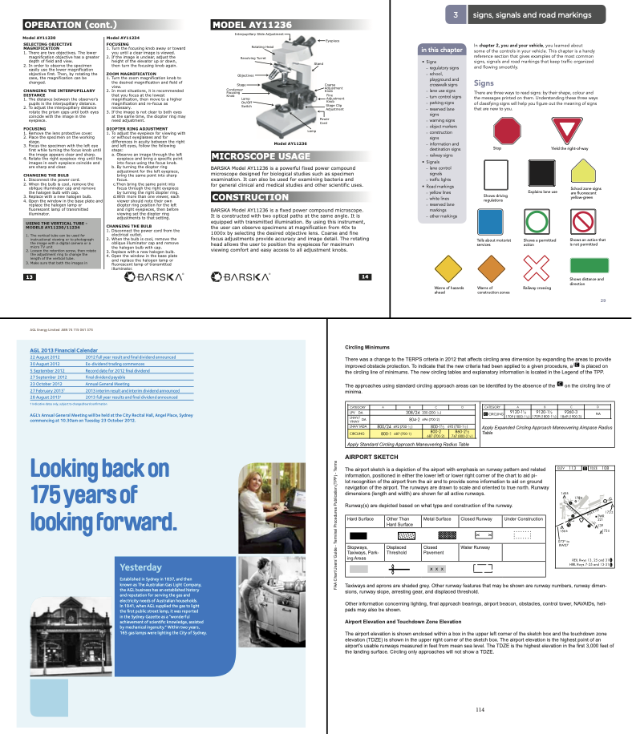

# ICDAR 2023 Competition on Robust Layout Segmentation in Corporate Documents

!!! info
		To participate and make submissions, please register on our [EvalAI challenge page](https://eval.ai/web/challenges/challenge-page/1923/). 

## Introduction

In this competition, we challenge you to advance the research in accurately segmenting the layout in a very broad range of document styles and domains. 

{ align=left width="300" }

Converting documents into a machine-processable format is an on-going challenge due to their huge variability in formats and complex structure. Recovering the layout structure and content from documents has remained a key problem since decades, and is as relevant as ever in 2023. To this date, a highly generalising model for structure and layout understanding has yet to be achieved. 

To raise the bar over previous competitions, we propose our newly published, human-annotated [DocLayNet](https://github.com/DS4SD/DocLayNet) data-set as the base for a new challenge on various documents from corporate, technical and law domains.

## News

|   |    |
| :---------- | :----------------------------------- |
| **Jan. 13th, 2023**      | The [competition-dataset](task#competition-data-set) is now released and submissions are opened on EvalAI. Register [here](https://eval.ai/web/challenges/challenge-page/1923/).|
| **Dec. 19th, 2022**      | This competition is now **live** and will run until March 20th, 2023. Find the detailed schedule [here](schedule)|

## Task and resources

We invite you to develop a model that can accurately segment the layout components in document pages as bounding boxes on our [competition data-set](task#competition-data-set). The layout prediction accuracy you achieve with your solution will be evaluated on this dataset with our human-annotated layout ground-truth. Code submissions are not required. Find the details [here](task).

We **highly recommend** you to use our recently published [DocLayNet](https://github.com/DS4SD/DocLayNet) dataset for training and internal validation. DocLayNet is highly diverse in layout coverage, and includes Financial reports, Patents, Manuals, Laws, Tenders and Technical Papers. It is human-annotated with 11 distinct layout class labels. Added value for model development is provided through the original PDF pages and a paired JSON representation of the text cells.

## Participation

Everyone is welcome to participate in this competition. To ensure fairness, we require teams to abide by the [participation rules](rules).

