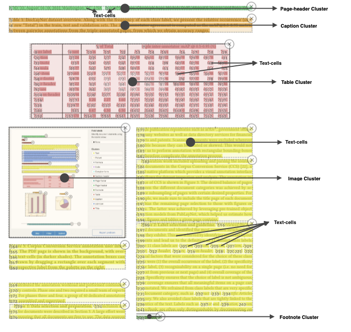

# Task

{ align=left width="400" }

You are invited to advance the research in accurately segmenting the layout on a broad range of document styles and domains. To achieve this, we challenge you to develop a model that can correctly identify and segment the layout components in document pages as bounding boxes on a competition data-set we provide.

## Training resources

In our recently published [DocLayNet](https://github.com/DS4SD/DocLayNet) ground-truth dataset, which contains 80k+ human-annotated document pages exposing diverse layouts, we define 11 classes for layout components (paragraphs, headings, tables, figures, lists, mathematical formulas and several more). We encourage you to use this dataset for training and internal evaluation of your solution.
Further, you may consider any other publicly available document layout dataset for training (e.g. [PubLayNet](https://github.com/ibm-aur-nlp/PubLayNet), [DocBank](https://github.com/doc-analysis/DocBank)).

!!! tip 
        DocLayNet provides not only bitmap page samples and COCO bounding-box annotations, but also the original PDF files and paired JSON with the digital text-cells. This may support you in exploring the most recent advancements in the ML landscape, such as multi-modal deep learning architectures.
        
 
## Evaluation

### Competition data-set

To assess the layout segmentation performance of your model, we will create a competition data-set of 500+ additional pages in the same manner as [DocLayNet](https://github.com/DS4SD/DocLayNet). To raise  the bar, this competition data-set includes a balanced mix of samples which fall into the layout distribution of DocLayNet, and samples which expose additional unseen layouts. Each sample will be categorized into one of the DocLayNet layout categories, or into `other`.

We will publish this competiton data-set, _without_ any ground-truth annotations, on Jan. 16th, 2023. Your task is to produce layout predictions with your model in COCO format, and submit these to our EvalAI project (registrations TBA). 

!!! note
		Please note that it is _not allowed_ to create ground-truth for the competition data-set and train your model on it. 

### Metric

Your submissions on EvalAI will be evaluated using the Mean Average Precision (mAP) @ Intersection-over-Union (IoU) [0.50:0.95] metric, as used in the [COCO](https://cocodataset.org/) object detection competition.  In detail, we will calculate the average precision for a sequence of IoU thresholds ranging from 0.50 to 0.95 with a step size of 0.05. This metric is computed for every document cateogry in the competition-dataset. Then the mean of the average precisions on all categories is computed as the final score.

### Submission 

We ask you to upload a JSON file in [COCO results format](https://cocodataset.org/#format-results), with complete layout bounding-boxes for each page sample. The given `image_id`s must correspond to the ones we publish with the competition data-set. For each submission you make, the computed mAP will be provided for each category as well as combined. The leaderboard will be ranked based on the overall mAP.
